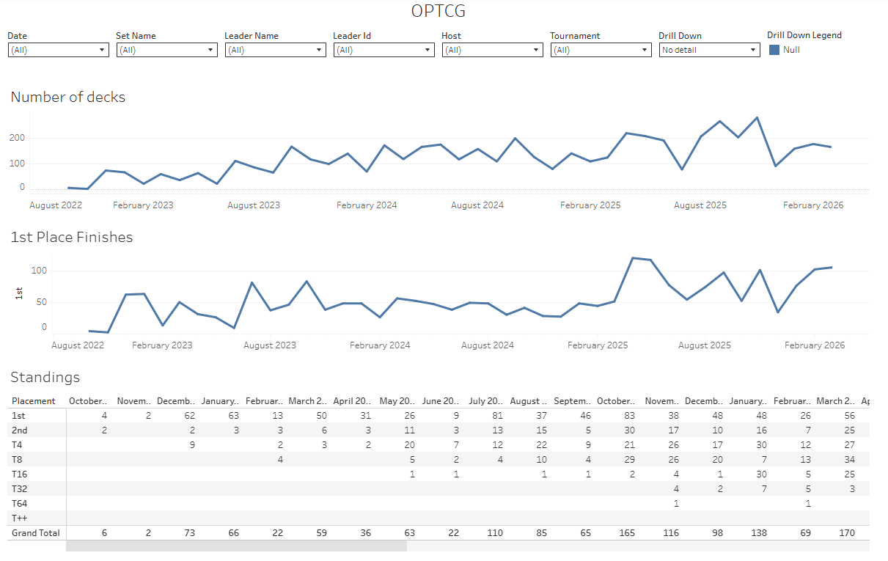

# JTF One Piece TCG Analytics Project

A data engineering project that scrapes, processes, and analyzes One Piece Trading Card Game (OPTCG) tournament deck data using modern data stack tools.

One Piece Trading Card Game (OPTCG) is a popular competitive game, though it's sometimes hard to get access to the top performing decks or run deeper performance analysis. Most relevant data is often locked behind paid tools. This project collects tournament data from one of the most popular websites (https://onepiecetopdecks.com/) parses and cleans it, and creates a dashboard for easy visualization.

## Project Overview

This project collects decklist data from OPTCG tournaments, transforms it using dbt, and provides analytics through a Tableau dashboard. It demonstrates end-to-end data pipeline orchestration with Dagster, supporting both local development (DuckDB) and cloud deployment (Google BigQuery).

## Features

- **Data Ingestion**: Automated scraping of decklists and leader card data from OPTCG websites
- **Data Transformation**: dbt models for staging, preparation, and mart layers
- **Orchestration**: Dagster pipelines for ETL workflows
- **Multi-Environment**: Local development with DuckDB, cloud deployment with BigQuery
- **Infrastructure as Code**: Terraform for GCP resource provisioning
- **Visualization**: Tableau dashboard for tournament analytics

## Tech Stack

- **Package Management**: uv
- **Orchestration**: Dagster
- **Transformation**: DBT
- **Databases**: DuckDB (local), Google BigQuery (cloud)
- **Scraping**: Python with BeautifulSoup4 and requests
- **IaC**: Terraform
- **Visualization**: Tableau
- **Language**: Python 3.13+

## Project Structure

```
├── jtf_optcg/              # dbt project
│   ├── models/
│   │   ├── raw/           # Source definitions
│   │   ├── stg/           # Staging models
│   │   ├── prep/          # Preparation models
│   │   └── mart/          # Mart models
│   ├── macros/            # Custom dbt macros
│   └── dbt_project.yml
├── orch/                   # Dagster orchestration
│   ├── assets/            # Dagster assets
│   ├── jobs/              # Dagster jobs
│   └── definitions.py     # Dagster definitions
├── setup/                  # Data ingestion scripts
│   ├── scrape_*.py        # Scraping scripts
│   ├── *_ingest.py        # Data loading scripts
│   └── terraform_infra.py # Infrastructure setup
├── pyproject.toml          # Python dependencies
└── README.md
```

## Setup and Workflow Instructions

### Prerequisites

- Python 3.13+
- uv (Python package installer and resolver)
- Terraform

```
uv sync  # Installs dependencies and creates virtual environment
```
   > **Note**: This project uses uv for all Python package management. The `uv.lock` file ensures reproducible environments across all deployment scenarios.
   You can activate the uv environment with `source .venv/bin/activate` or write `uv run` before any command.

**For cloud deployment only:**
- Google Cloud service account with appropriate permissions


### Local Development Setup

1. **Clone and install dependencies:**
   ```bash
   git clone <repository-url>
   cd jtf-project
   ```

2. **Set up DuckDB environment:**
   ```bash
   # Run the DuckDB ETL pipeline
   dagster job execute -f orch.definitions -j duck_extract_load
   ```

3. **Run dbt transformations:**
   ```bash
   # Update path in profiles.yml
   # Run dbt models using Dagster
   dagster job execute -f orch.definitions -j duck_dbt_build_model
   ```

### Cloud Deployment Setup

1. **Create Google Cloud service account:**
    
    Make sure you have the following permissions on your service account:
    - BigQuery Admin
    - BigQuery Data Owner
    - Compute Admin
    - Owner
    - Storage Admin
    - Storage Object Admin
    - Storage Object Creator
    - Viewer

    ```
    How to Download Service Account JSON Key
    If you don't have the JSON key file or need to download a new one:

    Go to Google Cloud Console

    Navigate to IAM & Admin > Service Accounts

    Or use the search bar and type "Service Accounts"
    Find your service account in the list

    It should look like: service-account-name@project-id.iam.gserviceaccount.com
    If you don't have a service account yet, click + CREATE SERVICE ACCOUNT and:
    Enter a name (e.g., dbt-bigquery-service-account)
    Click CREATE AND CONTINUE
    Add these roles:
    BigQuery Admin (or at minimum: BigQuery Data Editor, BigQuery Job User, BigQuery User)
    Click CONTINUE > DONE
    Click on your service account name to open its details

    Go to the KEYS tab

    Click ADD KEY > Create new key

    Select JSON as the key type

    Click CREATE

    The JSON key file will automatically download to your computer

    Save it in a secure location
    Never commit this file to Git or share it publicly - it contains credentials to access your GCP resources
    ```

2. **Update credentials file:**
   Place the downloaded `my_credentials.json` in the `setup/` directory.

3. **Run cloud pipeline:**
   ```bash
   # Create GCP infra
   dagster job execute -f orch.definitions -j gcp_infra
   # Run the GCP ETL pipeline
   dagster job execute -f orch.definitions -j gcp_bq_ingest
   # Update path in profiles.yml
   # Run dbt models using Dagster
   dagster job execute -f orch.definitions -j gcp_dbt_build_model
   ```

## Manual Usage

### Data Scraping

Run individual scraping scripts:
```bash
python setup/scrape_decklists.py
python setup/scrape_leaders.py
```

### dbt Development

```bash
cd jtf_optcg
dbt build      # Create the models
```

### Running the Pipeline

Start the Dagster webserver:
```bash
dagster dev
```
After running, you will see a message like
`- dagster-webserver - INFO - Serving dagster-webserver on`.

Access the UI at the shared URL to execute jobs manually or set up schedules.

## DBT Data Model

- **Raw Layer**: Source data from scraped CSV files
- **Staging Layer**: Cleaned and standardized data
- **Preparation Layer**: Business logic transformations
- **Mart Layer**: Analytics-ready datasets for reporting

Key entities:
- Decklists: Tournament deck information
- Leaders: Leader card details with attributes

## Dashboard

View the Tableau dashboard: [OPTCG Analytics Dashboard](https://public.tableau.com/app/profile/jo.o.fernando1427/viz/optcg_dashboard/OPTCG)

   > **Note**: A sample of the csv of the final mart table `tableau_sample.csv` was added together with a `optcg_dashboard.twb` tableau file, so it can be locally replicated. Open the file and change the data source to math the desired csv file.




## License

This project is for educational purposes as part of the Data Engineering Zoomcamp.